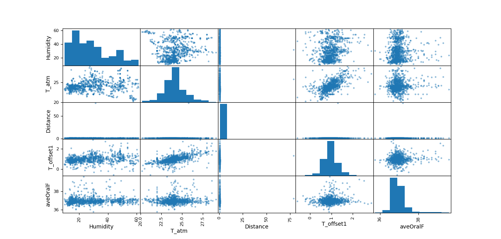

# Infrared Thermography Temperature Prediction

This project retrieves data from the UCI Machine Learning Repository to predict oral temperature using environmental information and thermal image readings. The data is sourced from [UCI Machine Learning Repository](https://archive.ics.uci.edu/), specifically the [Infrared Thermography Temperature Dataset](https://archive.ics.uci.edu/dataset/925/infrared+thermography+temperature+dataset).

## Libraries Used

- **Pandas**: Utilized for data manipulation, including loading data into DataFrames, preprocessing, and exploratory data analysis.
- **Matplotlib**: Used for data visualization, particularly to create scatter plots for exploratory data analysis.
- **Scikit-learn (sklearn)**: Employed for data preprocessing, including splitting the data into training and testing sets, and for feature scaling.
- **TensorFlow**: Utilized to build and train a neural network model for temperature prediction.
- **Flask**: Used to create a RESTful API for making temperature predictions.

## Functionality

1. **Data Retrieval**: Data is retrieved from the UCI Machine Learning Repository using the `ucimlrepo` library.
2. **Data Preprocessing**: The data is preprocessed using Pandas, including converting it to DataFrames, handling missing values, and scaling features.
3. **Exploratory Data Analysis (EDA)**: Matplotlib is used to visualize relationships between variables through scatter plots.
4. **Model Building**: A neural network model is built and trained using TensorFlow to predict oral temperature based on environmental information and thermal image readings.
5. **Model Evaluation**: The model is evaluated using mean squared error on both training and testing data.
6. **Flask API**: Flask is used to create a RESTful API endpoint (`/predict`) to make temperature predictions programmatically.

## Purpose and Takeaways

The purpose of this project is to demonstrate the process of building a temperature prediction model using machine learning techniques. Key takeaways include:

- Understanding data retrieval and preprocessing techniques using Pandas.
- Exploratory Data Analysis (EDA) to gain insights into the relationships between variables.
- Building and training a neural network model using TensorFlow.
- Creating a RESTful API with Flask for making predictions programmatically.

## Sample Output

